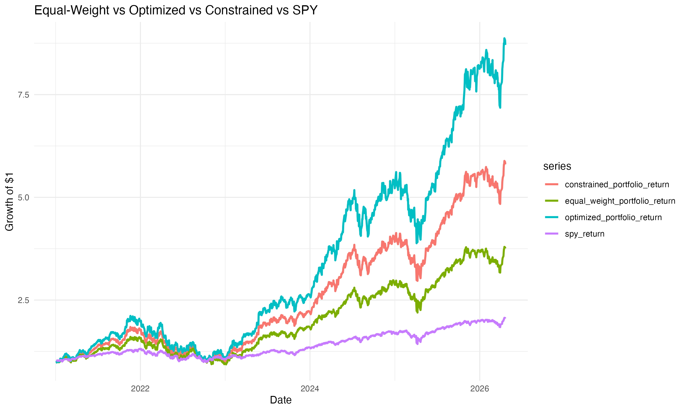

\# Portfolio Optimization & Risk Analytics in R\
\
\*\*Author:\*\* Jason Mahabir\
\
---\
\
\## Overview\
\
This project builds a portfolio analytics and optimization framework in
\*\*R\*\*, designed to evaluate and construct equity portfolios using
modern financial metrics. The analysis compares multiple portfolio
strategies—including equal-weight, unconstrained optimization, and
constrained optimization—against the S&P 500 (SPY) benchmark. The goal
is to demonstrate how different portfolio construction methods impact:

\
- Return \
- Risk \
- Diversification \
- Real-world applicability 

---\
\
\## Technologies & Packages Used\
\
- R \
- tidyverse \
- tidyquant \
- PerformanceAnalytics \
- xts \
- lubridate \
\
---\
\
\## Data\
\
\*\*Source:\*\* Yahoo Finance \
\
\*\*Assets analyzed:\*\*\
- Apple (AAPL) \
- Microsoft (MSFT) \
- Amazon (AMZN) \
- NVIDIA (NVDA) \
- Alphabet (GOOGL) \
\
\*\*Benchmark:\*\*\
- SPDR S&P 500 ETF Trust (SPY) \
\
\*\*Time Period:\*\* 2021 – Present (\~5+ years)\
\
---

\## Methodology\
\
\### 1. Data Processing\
- Pulled historical adjusted prices \
- Converted to daily returns \
- Structured data for portfolio analysis \
\
---\
\
\### 2. Portfolio Construction\
\
\#### Equal-Weight Portfolio\
- Equal allocation across all stocks \
- Serves as a baseline for comparison \
\
\#### Unconstrained Optimization (Max Sharpe)\
- Maximizes Sharpe ratio using mean-variance optimization \
- Allows full concentration in highest-performing assets \
\
\#### Constrained Optimization (35% Cap)\
- Maximum 35% allocation per asset \
- Prevents over-concentration \
- More realistic for real-world portfolio management \
\
---

\### 3. Performance Metrics\
\
Each portfolio is evaluated using:\
\
- Annual Return \
- Volatility (Standard Deviation) \
- Sharpe Ratio \
- Sortino Ratio \
- CAGR (Compounded Annual Growth Rate) \
- Maximum Drawdown \
- Beta vs SPY \
\
---

\## Results

| Portfolio         | Return | Volatility | Sharpe   | Sortino | CAGR  | Max Drawdown | Beta |
|-------------------|--------|------------|----------|---------|-------|--------------|------|
| Optimized         | 47.7%  | 36.1%      | 1.24     | 0.119   | 50.3% | 51.9%        | 1.68 |
| Constrained (35%) | 38.5%  | 31.6%      | **1.13** | 0.106   | 39.3% | 46.5%        | 1.56 |
| Equal-Weight      | 29.1%  | 27.9%      | 0.94     | 0.0866  | 28.3% | 41.8%        | 1.44 |
| SPY               | 15.2%  | 17.0%      | 0.72     | 0.0653  | 14.5% | 24.5%        | 1.00 |

\## Portfolio Performance Chart\
\

\*Growth of \$1 invested across the optimized, constrained,
equal-weight, and SPY portfolios.\*

---\
\
\## Analysis\
\
\### 1. Optimization Improves Performance\
- Optimized portfolios outperform both equal-weight and SPY \
- Sharpe ratio increases significantly \
\
\### 2. Tradeoff Between Risk and Return\
Higher-performing portfolios exhibit:\
- Higher volatility \
- Larger drawdowns \
- Higher beta (greater market exposure) \
\
\### 3. Concentration Risk in Unconstrained Optimization\
- Heavy allocation to a small number of stocks \
- Leads to extreme performance but increased downside risk \
\
\### 4. Impact of High-Growth Tech Stocks\
- Results driven by a tech-heavy market period \
- Concentration in top performers like NVIDIA \
- High-volatility compounding inflates returns \
\
---

\## Conclusion:

While Sharpe ratio optimization improved both return and risk-adjusted
performance, it resulted in a highly concentrated portfolio, primarily
allocated to NVIDIA and Alphabet. This highlights a key limitation of
unconstrained optimization, where the model over-allocates to
historically strong performers, potentially reducing diversification and
increasing exposure to idiosyncratic risk. This demonstrates that the
portfolio exhibiting the highest returns is not always the most
practical as balancing return, risk, and diversification is essential in
building a real-world portfolio. Introducing a constrained optimization
(35% cap) produced a more balanced portfolio that maintained strong
performance while improving diversification and reducing extreme risk.
Additionally, the results are influenced by a period of exceptional
growth in high-performing tech stocks such as NVIDIA (\~50% CAGR) which
was also associated with substantial drawdowns (\~51%). These findings
are historical and should not be interpreted as realistic long-term
expectations.

------------------------------------------------------------------------

\## Future Improvements\
\
- Add user-controlled portfolio constraints \
- Expand asset universe (ETFs, bonds, sectors) \
- Incorporate factor models or machine learning approaches 
